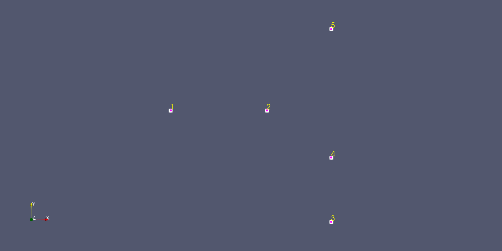
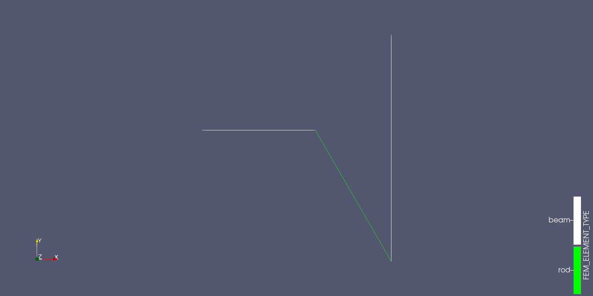
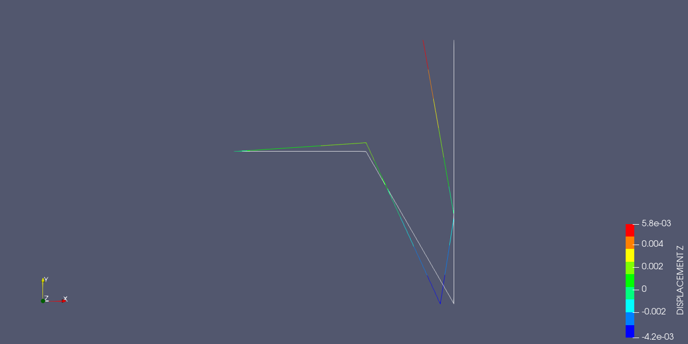
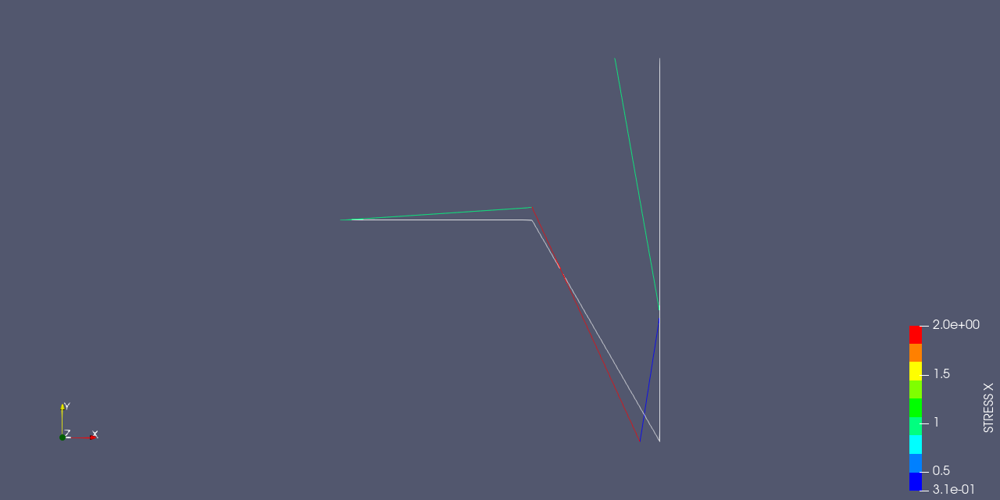

# Overview

Simple python script to calculate planar truss and beam structures based on the finite element approach derived from [[1]](#1).

Three python scripts (`./scripts/solver/pkgs`) for solving the structural problem have been developed:
- `fem_classes.py`
- `fem_functions.py`
- `parse_input_file_linear_static.py`

The main file to run the analysis is located in 

    ./scripts/solver/solve_LinearStatic.py

# Input File Strucutre

The input file is created on text editor basis and is structured into following parts:

### **Node Definition**

The nodal inputs are defined after using the `*node` keyword. 

```
*node
node_id, x-coordinate, y-coordinate
```

There is no need to define the z-coordinate due to the planar analysis type.

### **Element Definition**

The element inputs are defined after using the `*element` keyword. 

- Rod element types are defined as followed:

```
*element, type=rod
element_id, first_node_id, second_node_id
```

- Beam element types are defined as followed:

```
*element, type=beam
element_id, first_node_id, second_node_id
```
### **Property Definition**

The element property inputs are defined after using the `*property` keyword. 

- Rod properties are defined as followed:

```
*property rod
first_element_id, last_element_id, E, A
```

- Beam properties are defined as followed:

```
*property beam
first_element_id, last_element_id, E, A, I, h_max
```

With

    E     : Modulus of elasticity 
    A     : Cross section
    I     : Area moment of interia
    h_max : Distance from the neutral axis to the top and bottom of the cross section (for the strain and stress calctulation)
    

### **Loads Definition**

The load inputs are defined after using the `*load` keyword.

```
*load
node_id, local_degree_of_freedom, value 
```

### **Constraints Definition**

The constraints inputs are defined after using the `*boundary` keyword.

```
*boundary
node_id, first_local_degree_of_freedom, last__local_degree_of_freedom, value 
```

A fixed dof has a value of `0.` Enforced displacements are also defined within the constraints definition with a value `not equal 0.`

### **Example Input File**

The example input file `ws_11_12.txt` can be found in the `./examples/truss_beam_test/ws_11_12` directory.

```
*node
1,0.,0.
2,750.,0
3,1250.,-866.0254
4,1250.,-366.0254
5,1250.,633.9746
*element, type=rod
2,2,3
*element, type=beam
1,1,2
3,3,4
4,4,5
*property rod
2,2,30000.,20.
*property beam
1,1,30000.,40.,16000.,5
3,4,30000.,50.,25000.,5
*load
5,1,-10.
*boundary
1,1,3,0.
2,2,2,1.
4,1,1,0.
4,2,2,0.
```

# Visualize Input File FE Model

To visualize the finite element model defined by the input file the ``txt2vtk.py`` python script can be used which is
stored in the ``./scripts`` directory. This python script converts the ``*node`` and ``*element``
block into a VTK file which can be opened/visualized with the open-source multiple-platform application _ParaView_.


The script creates a `NODE.vtu` and a `ELEMENT.vtu` file. The `NODE.vtu` can be used to visualize 
the nodal points.



The `ELEMENTS.vtu` can be used to visualze the defined elements.


Further the element type can be visualzed with the `ELEMENTS.vtu` file.




# Solve the FE Model

To solve the FE model input use the `solve_LinearStatic.py` file in `./scripts/sovler`. 

The script will write out some basic information into the terminal screen (e.g. for `ws_11_12.txt`):

```
[INF] Run Linear Static Solver (Version 1.0.0)
[INF] Parsing input file: ./input_files/truss_beam_test/ws_11_12/ws_11_12.txt
      Number of nodes: 5
      Number of elements: 4
      Number of SPCs: 4
      Number of loads: 1
[INF] Element properties (Element type, eid, n1, n2, length, rotation angle, E, A, I)
      Beam, 1, 1, 2, 750.00, 0.00, 30000.0, 40.0, 16000.0
      Rod, 2, 2, 3, 1000.00, 300.00, 30000.0, 20.0
      Beam, 3, 3, 4, 500.00, 90.00, 30000.0, 50.0, 25000.0
      Beam, 4, 4, 5, 1000.00, 90.00, 30000.0, 50.0, 25000.0
[INF] SPCs (nid, first DOF, last DOF, value)
      1, 1, 3, 0.0
      2, 2, 2, 1.0
      4, 1, 1, 0.0
      4, 2, 2, 0.0
[INF] Loads (nid, DOF, value)
      5, 1, -10.0
[INF] Map nodal local DOF to global DOF
      Nodal DOF mapping: {1: [1, 2, 3], 2: [4, 5, 6], 3: [7, 8, 9], 4: [10, 11, 12], 5: [13, 14, 15]}
      Element DOF mapping: {1: [1, 2, 3, 4, 5, 6], 2: [4, 5, 7, 8], 3: [7, 8, 9, 10, 11, 12], 4: [10, 11, 12, 13, 14, 15]}
[INF] Assemble global stiffness matrix K
      Global stiffness matrix size: (15, 15)
[INF] Solve linear system of equations K * u = f
[INF] Post process results
[INF] Write FE results to file
      Results written to ./input_files/truss_beam_test/ws_11_12/
Done.
```

Two output files will be created. A ``.out`` were the reults will be 
summarized in a text file and a ``.h5`` were the nodal and elemental 
results are stored. The .h5 file format is also known as the Hierarchical Data Format version 5, and it is saved 
as a binary file. 

As an example the output file ``ws_11_12.out`` is shown below:

```
 
                                      R e s u l t s                                       
 
              Linear Static Analysis for Planar Truss and Beam Structures
 
 
 Input file: ws_11_12.out
 
 
                        S u m m a r y   F E   M o d e l   S i z e
 
                              Number of Nodes       5
                              Number of Elements    4
                                     incl.  Rods    1
                                     incl. Beams    3
                              Total Number of DOFs  15
                              Number of SPCs        4
                              Number of Loads       1
 

 
                          N o d a l    D i s p l a c e m e n t s

nid     u_x             u_y             u_R            
1       0.0000e+00      0.0000e+00      0.0000e+00
2       1.2500e-02      1.0000e+00      2.0000e-03
3      -1.5662e+00      1.1547e-02     -4.2435e-03
4       0.0000e+00      0.0000e+00     -9.1021e-04
5      -3.5342e+00      2.1600e-16      5.7565e-03

 
                        N o d a l   R e a c t i o n   F o r c e s

nid     RF_x            RF_y            RM             
1      -2.0000e+01     -3.4133e+00     -2.5600e+03
2      -2.1316e-14      3.8054e+01      0.0000e+00
3       1.4211e-14      4.9738e-14      9.0949e-13
4       3.0000e+01     -3.4641e+01      2.7265e-12
5      -1.0000e+01      5.7332e-29      1.8151e-12

 
                            E l e m e n t a l   S t r a i n s

eid     Pt. 1           Pt. 2          
1       3.0000e-05      3.3333e-06
2       6.6667e-05      6.6667e-05
3       1.0239e-05     -5.6427e-05
4       3.3333e-05     -3.3333e-05

 
                           E l e m e n t a l   S t r e s s e s

eid     Pt. 1           Pt. 2          
1       9.0000e-01      1.0000e-01
2       2.0000e+00      2.0000e+00
3       3.0718e-01     -1.6928e+00
4       1.0000e+00     -1.0000e+00
 

                               E n d   o f   R e s u l t s 
```

# Visualize the FE Results

To visualize the FE results the ``vtkpost.py`` python script can be used which is
stored in the ``./scripts`` directory. The stored results from the ``.h5`` file will be 
mapped to the `ELEMENTS.vtu` file.

- Displacement X,Y and Z (here it's the rotation around the Z-Axis) direction results




The deformed scale factor (warp by vector) is set to 50.

- Stress values at point 1 (top surface of the cross section):




The nodal reaction loads as well as the elemental strains can be visualized.

# Summary and Outlook

The FE results calculated with the python code (see files in`./examples/input_files`) have been tested and verified. The FE models for the truss and beam strucutres and their results for verification are taken from [[2]](#2).

The visualization of the loads and boundary conditions are yet not
implemented in `txt2vtk.py` but will be provided in a later version.

# References
[[1]](#1) Finite Element Method Lecture Notes, Frankfurt University of Applied Sciences

[[2]](#2) Öchsner, Andreas & Öchsner, Marco. (2018). A First Introduction to the Finite Element Analysis Program MSC Marc/Mentat. 10.1007/978-3-319-71915-3. 
